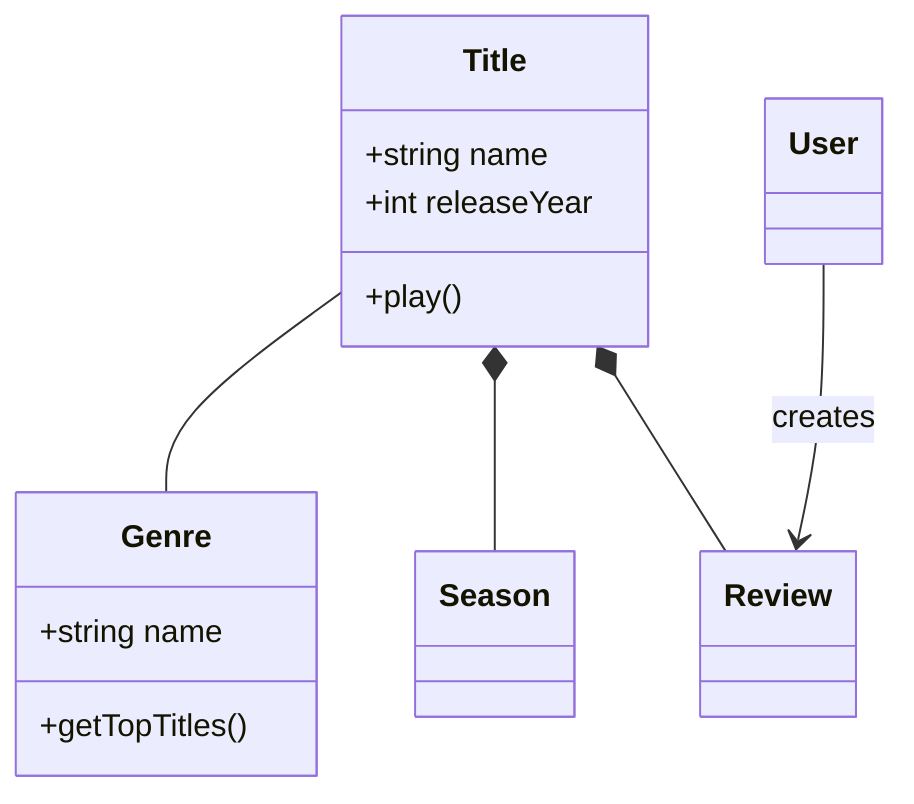
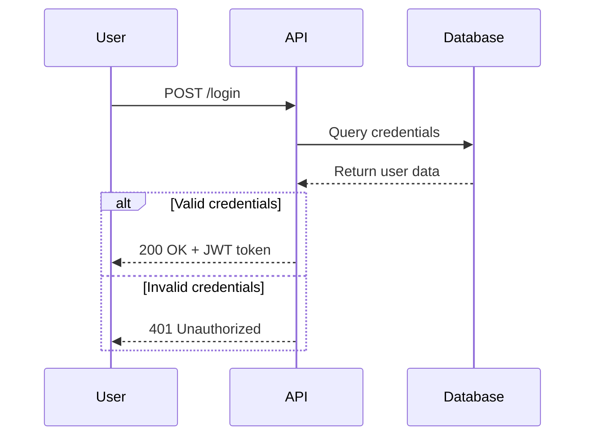
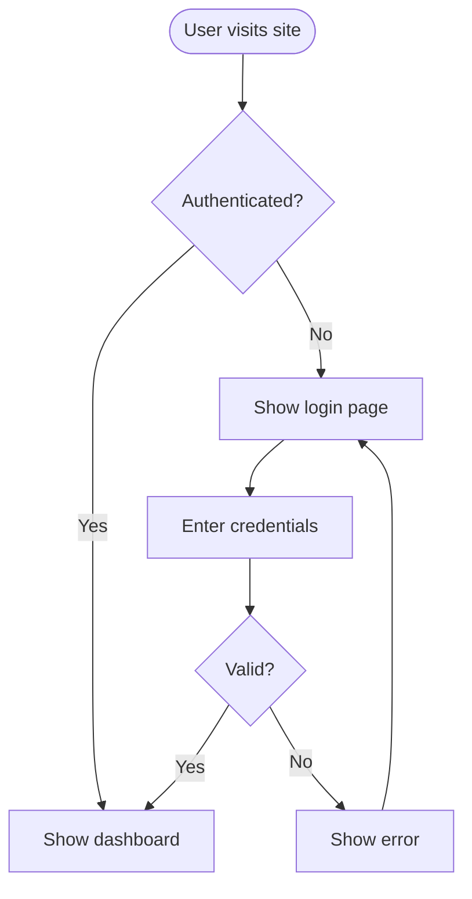
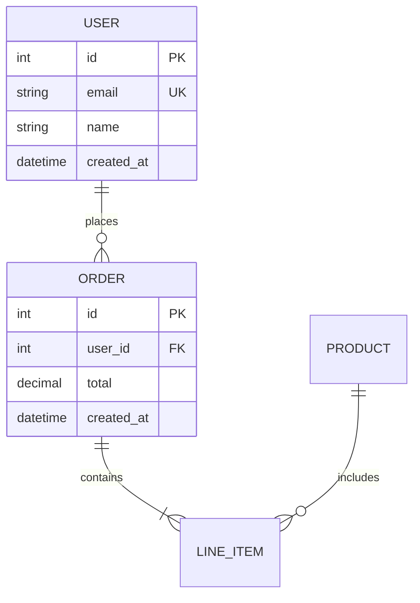
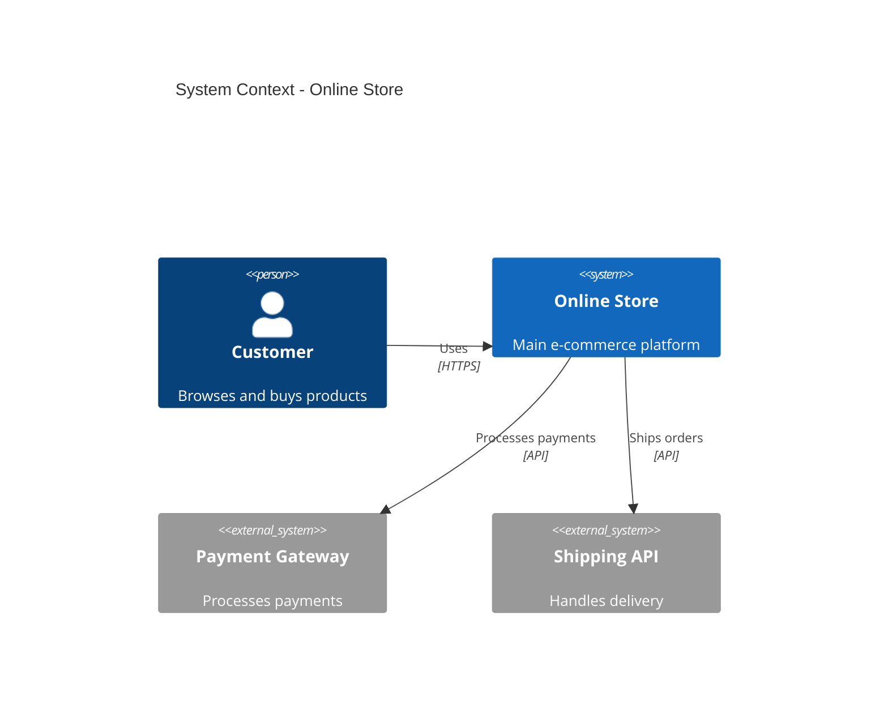
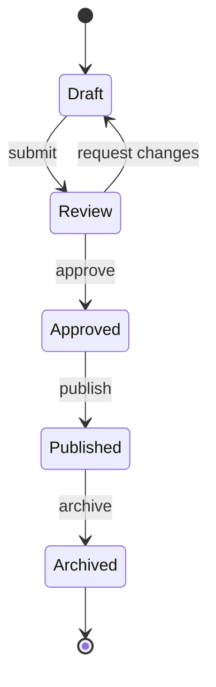
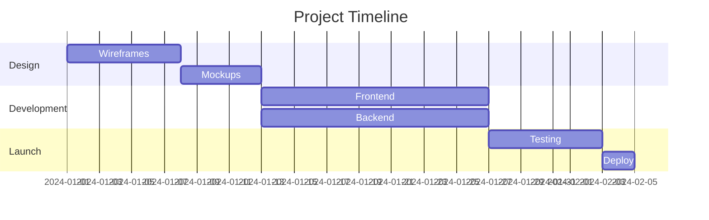
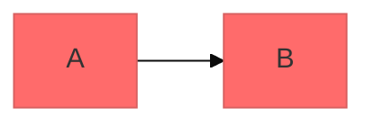

# Mermaid Diagramming Skill

Create professional software diagrams using Mermaid's text-based syntax. Mermaid renders diagrams from simple text definitions, making them version-controllable, easy to update, and maintainable alongside code.

## Why This Skill

Every agent that writes code, documents systems, or explains architecture needs diagrams. This skill gives you:

- **9 diagram types** with syntax reference and examples
- **Selection guide** — pick the right diagram for the job
- **Best practices** — avoid common pitfalls that break renders
- **Theming & export** — configure look, export to PNG/SVG
- **Production patterns** — real-world examples for APIs, databases, CI/CD, domain models

No dependencies. Works anywhere Mermaid renders (GitHub, VS Code, Notion, Obsidian, Confluence, or CLI export).

## Diagram Type Selection Guide

| Need | Diagram Type |
|------|-------------|
| Domain modeling, OOP design | Class Diagram |
| API flows, message passing | Sequence Diagram |
| Processes, algorithms, decisions | Flowchart |
| Database schemas | ERD |
| System architecture (multi-level) | C4 Diagram |
| State machines, lifecycles | State Diagram |
| Branching strategies | Git Graph |
| Project timelines | Gantt Chart |
| Data breakdowns | Pie/Bar Chart |

## Core Syntax

All Mermaid diagrams follow this pattern:

```mermaid
diagramType
  definition content
```

**Key rules:**
- First line declares diagram type (`classDiagram`, `sequenceDiagram`, `flowchart`, etc.)
- Use `%%` for comments
- Line breaks and indentation improve readability but aren't required
- Unknown keywords break diagrams silently — validate syntax before shipping

## Quick Start Examples

### Class Diagram (Domain Model)


### Sequence Diagram (API Flow)


### Flowchart (User Journey)


### ERD (Database Schema)


### C4 System Context


### State Diagram


### Gantt Chart


## Configuration and Theming

Configure diagrams using frontmatter:



**Available themes:** `default`, `forest`, `dark`, `neutral`, `base`

**Look options:**
- `look: classic` — Traditional Mermaid style
- `look: handDrawn` — Sketch-like appearance

## Exporting and Rendering

**Native support:** GitHub, GitLab, VS Code (with extension), Notion, Obsidian, Confluence

**CLI export:**
```bash
npm install -g @mermaid-js/mermaid-cli
mmdc -i input.mmd -o output.png
mmdc -i input.mmd -o output.svg
```

**Docker:**
```bash
docker run --rm -v $(pwd):/data minlag/mermaid-cli -i /data/input.mmd -o /data/output.png
```

**Online:** [mermaid.live](https://mermaid.live) — browser editor with PNG/SVG export

## Best Practices

1. **Start simple** — core entities first, add detail incrementally
2. **One concept per diagram** — split complex systems into focused views
3. **Use meaningful names** — clear labels make diagrams self-documenting
4. **Comment with `%%`** — explain complex relationships
5. **Version control** — store `.mmd` files alongside code
6. **Validate before shipping** — paste into mermaid.live to catch syntax errors

## Common Pitfalls

- **Special characters** — `{}` in text nodes breaks rendering; wrap in quotes
- **Misspellings** — keyword typos fail silently
- **Overcomplexity** — diagrams with 20+ nodes become unreadable; decompose
- **Missing relationships** — if two things interact, draw the line
